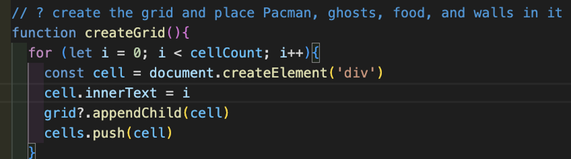

# GA Project 1 - Pacman

# Contents
- [Description](#description)
- [Technology used](#technologies-used)
- [Project brief](#brief)
- [Planning](#planning)
- [Build process](#build-process) <!-- - [Pathfinder](#pathfinder) -->
- [Challenges](#challenges)
- [Wins](#wins)
- [Key learnings](#key-learnings)
- [Bugs](#bugs)
- [Future improvements](#future-improvements)

# Description

The aim of this project was to create a Pacman-style game in a week using only HTML, CSS, and JavaScript.

# Deployment link

https://giomine.github.io/Chuchu-Pacman/

# Timeframe & Working Team (Solo/Pair/Group)

This project was to be completed independently within a week.

# Technologies Used

HTML, CSS, JavaScript, Excalidraw.

# Brief

The player aims to eat all the food in a maze whilst being hunted by ghosts. If the player eats special flashing food the ghosts start to flash and can now be captured by the player, sending them back to their holding pen, from where they can once again start to hunt the player. The aim is to achieve the highest score possible before being killed by the ghosts.

Requirements:
* The player should be able to clear at least one board.
* The player's score should be displayed at the end of the game.

Suggested Enhancements:
* Responsive design.
* Each board gets more difficult.
* Persistent leaderboard using localStorage.

The biggest challenge here is the logic which moves the ghosts. While their movement may appear random, they are always moving toward Pac Man, who is himself being moved by the player.

# Planning

Before writing any code I took several steps to ensure I had a clear plan. I first created a wireframe on [excalidraw](https://www.excalidraw.com) so that I had a clear picture of how I wanted my game to look and how this would be divided into sections and functions on the page.

I made sure I understood both the brief and the rules of the game very thoroughly before writing pseudocode outlining all of the variables, functions, and event listeners I would need for this project.

# Build Process

I started by creating a grid dynamically using JavaScript rather than hard-coding cells.

This allowed me to place and move things within the grid space very easily. For example, for the walls I created arrays of numbers with each number corresponding to a cell number, so in my addWall() function a class of ‘wall’ is added to the specified cells and walls would appear.

I followed similar logic for placing the ghosts, pacman, flashing food, and food in the grid.

I was able to enforce collisions with walls and ghosts by checking the cells around pacman and the ghosts every time they move using conditions and ternary statements. For example, if the cell on the right contains a class of ‘wall’ then the character will not be able to move in that direction. This logic was also applied to the ghosts to ensure that they too cannot walk through walls. In the ghostCollision() function, a collision with a ghost decrements lives by one and if lives reaches 0 it triggers game over.

Once all of these game requirements were fulfilled, I really wanted to have some fun adding extras.  
I started by adding more levels to my game. I created two more walls arrays and two more flashing food arrays all with different variable names, so that when one level is completed, the next wall layout and flashing food positions will be loaded.   
I then added more themes to my game, so the player can choose if they want to play with a classic Pacman theme, or Parappa the Rapper, or ChuChu Rocket theme. The choice is saved in local storage, and this then affects the walls, food, music, player character, and ghosts that load up.

I also created a cheat code for my game. What is a retro game without a cheat for infinite lives! (This also really helped me out when testing my game).

<!-- # Pathfinder -->
With most of the extras I wanted now complete, I had plenty of time left to focus on creating a pathfinder for the ghosts to make them follow Pacman rather than just let them move at random. 
I started by researching what a pathfinder is and how it works. I discovered there are four main types of pathfinding algorithms, however the theory behind them was very complex and did nothing more than intimidate me, so I decided to step away and plan according to what I specifically needed.

 
By approaching the problem in such simple terms, it really felt very manageable and I was able to work towards solving it step by step.  
I started by getting Pacman’s coordinates each time he moves. I then got the coordinates of each cell surrounding each ghost at any given time, and with each ghost movement these coordinates are pushed into two arrays representing options for movement on the X axis and on the Y axis.

Next, these arrays are looped through and at each iteration Pacman’s coordinates are minused from each number in the array, and this measures the distance of each cell from Pacman. From there, the smallest distance is chosen, and the index of the lowest number informs the ghosts’ next movement - index 0 moves the ghost to the right, index 1 moves the ghost to the left, index 2 moves the ghost up, and index 3 moves the ghost down. The reason for this is because of the order the original coordinates were pushed into the array as you can see in the screenshot above - the first number pushed into the array represents the cell on the right, and so on. The pathfinder runs on intervals, and I wrapped all of this in a timeOut as well in order to stagger each ghost’s initial movement by a couple of seconds to mimic the original Pacman game where the ghosts do not all leave the pen at the same time but several seconds after each other. Overall the pathfinder was quite tricky to implement, but very satisfying when successful!

Finally, I had some time left over in which I could add my final touches.
I polished up the overall design for the start screen and for each theme, which included lots of CSS, some animations, and editing tons of images found online for all the different themes, characters, start screen and backgrounds.
The top score is displayed on both game screen and start screen, and stored in local storage.
I finalised the wall designs for each level, making sure each level was more challenging than the last but also fun to play.
I added a choice of three difficulties, with each one affecting the speed of the ghosts.
I added tons of sound effects to bring the game to life -
The start screen uses sounds from Pacman, Parappa the Rapper, and Chuchu Rocket for the theme buttons and sound from Shenmue for the difficulty buttons;
Each theme plays matching background music from Pacman, Parappa, or Chuchu Rocket;
Game over triggers a sound from Parappa the Rapper, and beating the game triggers the victory sound from FFVII;
And a bump sound plays if you collide with a ghost.

# Challenges

The most challenging part was of course the pathfinder! It was quite difficult to keep track of the necessary steps and calculations in my mind as there was a lot of maths, timing, coordinates, array mutation and positioning involved. Careful debugging was required at every step, and debugging while the ghosts are moving is tricky because there are many sets of coordinates and arrays being produced with every single movement. I made debugging a little easier by colour-coding my logs in the console. For example I made coordinates relating to the ghosts log in yellow, pacman in red, and arrays in white. This made it easier to compare one part to another and check that everything was working as intended.

# Wins

I’m proud that I came up with my own algorithm for pathfinding despite being very intimidated by it! I’m also happy with the final design, sounds, and all the extras I was able to implement due to managing my time well.

# Key Learnings

I gained a lot more confidence tackling unfamiliar problems since I was able to implement a pathfinder, something I had not heard of before, within the given time. 
It was also fascinating to learn what amazing things can be created on a dynamic grid and I would love to use this for more projects.

# Bugs

I was very attentive to bugs throughout this project so I was able to squash most of them as they appeared. 
The trickiest bug occurred while creating the pathfinder. Initially only the fourth ghost followed Pacman everywhere while the other three ghosts only followed left and right. Using coloured console logs and checking each part of the pathfinder, I was able to narrow down the issue. Eventually I found that it was only the up and down movements that weren’t working correctly, and this led to the discovery that I had just written two lines in the wrong place. Then all I had to do was switch them over and the issue was fixed!

One known bug remains, and that is that the flashing food doesn’t always work as intended. If a few seconds lapse between eating flashing food then the effects last 5 seconds as expected, however if they are eaten in quick succession then the second food only makes the ghosts catchable for about half a second. I suspect this is due to the timer not having time to reset properly. If I had more time I would love to investigate further and fix this bug.

# Future Improvements

I would love to create a mobile version of this game so that I can send it to my nephew! This would involve adding responsive CSS as well as adding swiping functionality.

[Update]
Post-deadline I did complete the mobile version. I also turned it into an app using Electron.js which was really exciting to see my game work as an app on my laptop!
I had some difficulty learning how to use the GITHUB_TOKEN in a way that allowed Forge to publish the app, however this solution I found online solved the issue:

However I am having difficulty publishing the app because some of the files are blocked by Github due to being too large.

I would like to learn how to overcome this issue so that my nephew can play this game as an app :)

